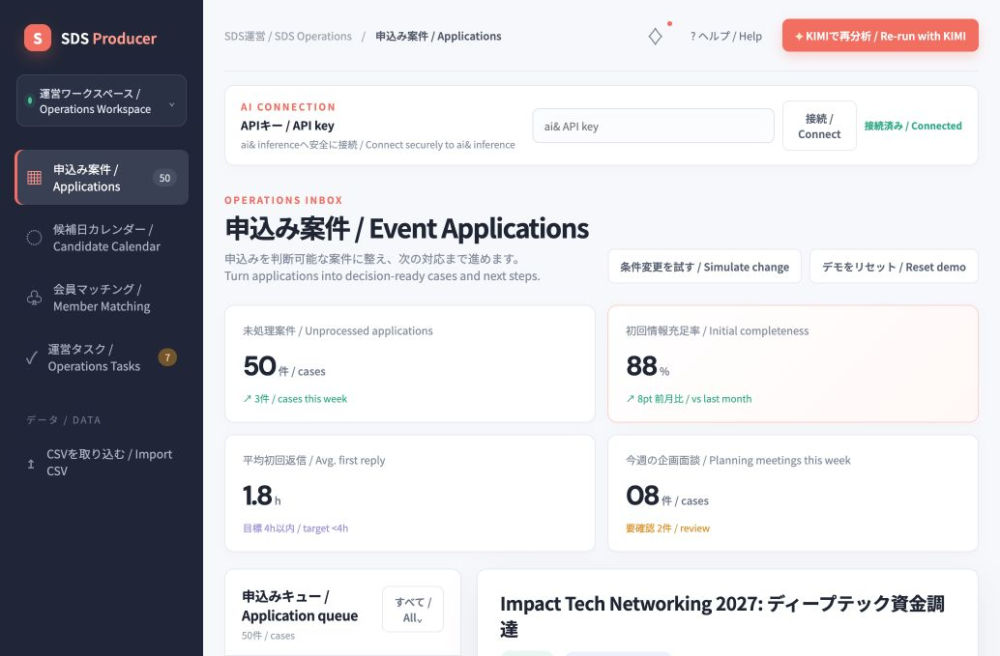
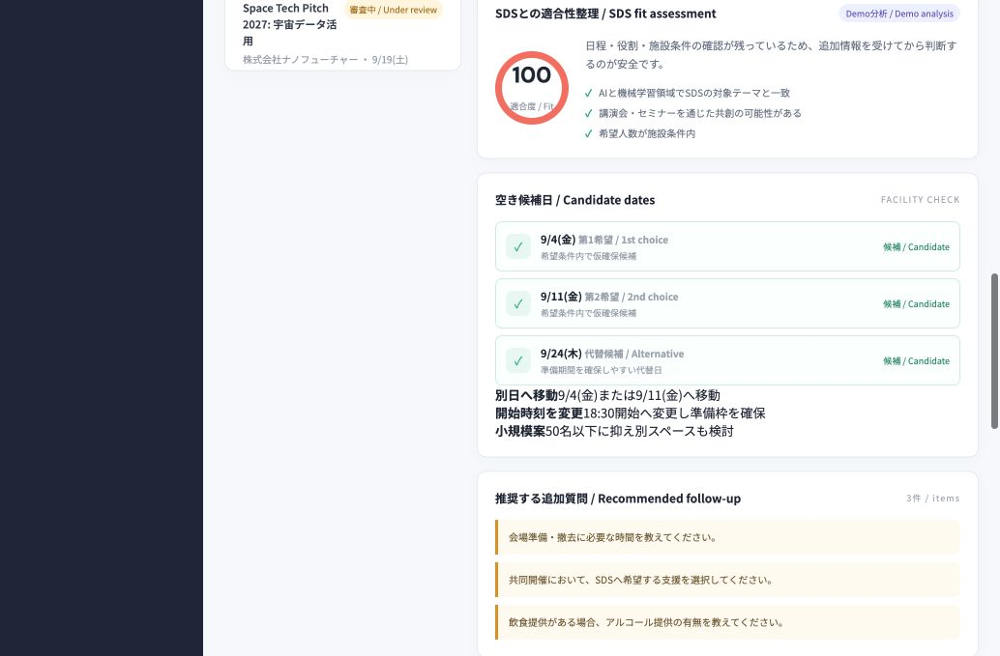

# SDS Event Producer Agent

An operations-first web MVP that turns event applications into structured, reviewable cases for SDS staff.

The agent identifies missing information, checks dates and facility constraints, summarizes SDS fit, suggests relevant anonymous member or partner profiles, creates operational tasks, and drafts an applicant reply. KIMI prepares analysis and wording while final decisions remain with the SDS operator.

[日本語版はこちら](#日本語)

## Screenshots





## What it does

After an event application arrives, SDS staff need to turn inconsistent form responses into a case that can be reviewed and acted on. This MVP brings that work into one dashboard.

- Loads the bundled 50-case demo dataset or an imported CSV.
- Calculates information completeness and generates specific follow-up questions.
- Summarizes why an event may fit SDS.
- Checks requested dates and capacity with deterministic demo rules.
- Suggests anonymous member or partner profiles and possible roles.
- Generates internal tasks, a recommended next action, and an applicant reply draft.
- Replans when the preferred date becomes unavailable.
- Runs without an API key using deterministic demo analysis.

## AI and application responsibilities

| KIMI 2.7 | Application code |
| --- | --- |
| Interprets free-text event details | Parses and validates request data |
| Explains SDS fit | Calculates information completeness |
| Suggests questions and alternative plans | Checks dates, capacity, and scenario state |
| Proposes anonymous member or partner roles | Manages the case queue and UI state |
| Drafts tasks and applicant replies | Keeps secrets on the server |

KIMI does not approve events, confirm reservations, or contact applicants or members. Those actions always require an SDS operator.

## Quick start

### Requirements

- Node.js 18 or newer; Node.js 20 or newer is recommended.
- npm.

### Run the demo

```bash
npm install
npm start
```

Open [http://localhost:3000](http://localhost:3000).

The bundled CSV is loaded automatically. No API key is required for demo mode.

For development with automatic server restart:

```bash
npm run dev
```

## Enable KIMI analysis

Copy the environment template:

```bash
cp .env.example .env
```

Set your ai& API key in `.env`:

```dotenv
PORT=3000
AIAND_BASE_URL=https://api.aiand.com/v1
AIAND_API_KEY=replace_with_your_aiand_api_key
AIAND_MODEL=moonshotai/kimi-k2.7-code
```

Restart the server, open the dashboard, select a case, and click **KIMIで再分析**.

The API key is read only by the Node.js server and is never sent to the browser. Do not place credentials in `public/app.js`, a URL, or a Git commit.

## Demo flow

1. Select an application from the queue.
2. Review completeness, SDS fit, candidate dates, questions, suggested profiles, tasks, and the reply draft.
3. Click **条件変更を試す** to make the first requested date unavailable and review the alternatives.
4. Click **KIMIで再分析** to replace the demo wording with live KIMI analysis when an API key is configured.
5. Click **デモをリセット** to return to the initial case and scenario.

## Architecture

```text
Browser
  public/index.html
  public/styles.css
  public/app.js
       |
       | POST /api/analyze
       v
Node.js server
  server.mjs
       |
       | optional server-side request
       v
ai& OpenAI-compatible API
  model: moonshotai/kimi-k2.7-code
```

The application uses plain HTML, CSS, and JavaScript with a small Node.js HTTP server. Deterministic analysis remains available when the external AI service is not configured.

## Repository structure

```text
.
├── .env.example
├── package.json
├── server.mjs
├── README.md
└── public
    ├── app.js
    ├── index.html
    ├── styles.css
    ├── assets
    └── data
        └── sds_event_request_sample_50.csv
```

## Safety and limitations

This repository is a hackathon demo, not a production reservation system.

- Final approval, reservation confirmation, and external communication remain human actions.
- Member profiles use anonymous demo labels; the application does not expose member contact details.
- The bundled CSV contains synthetic contact information. Do not add real personal data to this public repository.
- Production use would require authentication, persistent storage, audit history, policy-backed facility rules, calendar integration, and stronger API error handling.

## License

No project-specific license has been added. Add an appropriate license before redistributing or using the project in production.

---

## 日本語

[Back to English](#sds-event-producer-agent)

### SDS Event Producer Agentとは

SDS Event Producer Agentは、イベント申込みをSDS運営担当者が確認・判断しやすい案件へ整理するWeb MVPです。

申込内容の不足確認、SDSとの適合性整理、日程・施設条件の確認、匿名の会員・パートナー候補提案、運営タスク作成、申込者への返信案作成を一つの画面にまとめます。KIMIは分析と文章作成を支援し、最終判断はSDS運営担当者が行います。

### 主な機能

- 同梱された50件のデモCSVを案件キューとして表示
- 情報充足率と具体的な追加質問の生成
- SDSとの適合理由の整理
- 日程・人数・施設条件のデモ判定
- 匿名の会員・パートナー候補と役割の提案
- 運営タスク、次の対応、返信案の生成
- 希望日が使えない場合の代替案作成
- APIキーなしで利用できるデモ分析

### 起動方法

Node.js 18以上とnpmが必要です。

```bash
npm install
npm start
```

[http://localhost:3000](http://localhost:3000) を開いてください。APIキーがなくても同梱データを使ったデモを確認できます。

### KIMIを有効にする

```bash
cp .env.example .env
```

`.env`にai& APIキーを設定します。

```dotenv
PORT=3000
AIAND_BASE_URL=https://api.aiand.com/v1
AIAND_API_KEY=ここにAPIキーを設定
AIAND_MODEL=moonshotai/kimi-k2.7-code
```

サーバーを再起動し、案件を選んで **KIMIで再分析** を押してください。

APIキーはNode.jsサーバーだけが読み取り、ブラウザには渡しません。`public/app.js`、URL、README、Gitのコミットには認証情報を記載しないでください。

### デモ手順

1. 左側のキューから案件を選びます。
2. 情報充足率、適合性、候補日、追加質問、候補プロフィール、タスク、返信案を確認します。
3. **条件変更を試す** を押して、第1希望日が使えない場合の代替案を確認します。
4. APIキー設定時は **KIMIで再分析** を押してライブ分析を実行します。
5. **デモをリセット** で初期状態へ戻します。

### 安全性と制約

このリポジトリはハッカソン用のデモMVPであり、本番の予約システムではありません。

- 開催承認、予約確定、外部連絡は人間が行います。
- 会員候補は匿名のデモラベルで表示します。
- 公開リポジトリへ実在する個人情報を追加しないでください。
- 本番化には認証、データ永続化、監査履歴、実際の施設ルールやカレンダーとの連携が必要です。
